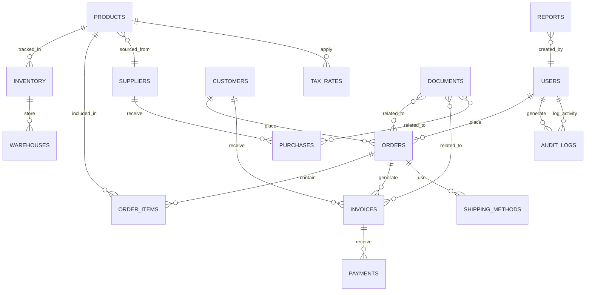

# Toy ERP System Implementation Plan

## Executive Summary

This document outlines the implementation plan for a comprehensive ERP system for Toy, a retail business specializing in shop fittings and equipment for supermarkets. The system will be built using Payload CMS 3, Next.js, and MongoDB, with a focus on automation, multi-tenant access control, and integration capabilities.

## Business Requirements

Toy operates a 4800m² warehouse and sources products from various suppliers. The business requires:

- **Multi-tenant system**: Different staff access levels using Payload's multi-tenant plugin
- **Inventory management**: Managing warehouse stock, locations, and supplier relationships
- **E-commerce**: Online shop for customers
- **In-store sales**: Barcode scanning for in-store purchases
- **Invoicing and finance**: Generation of invoices and financial management
- **Delivery management**: Tracking and managing deliveries
- **Document generation**: Creating and exporting documents for all transactions
- **Third-party integrations**: Including Elster (German tax reporting) and other services
- **Visual analytics dashboard**: Using shadcn components to monitor all collections

## System Architecture

### Frontend
- Next.js for server-side rendering and static generation
- React for UI components
- shadcn UI for dashboard components
- TailwindCSS for styling

### Backend
- Payload CMS as the core framework
- MongoDB for data storage
- Node.js for server-side logic
- GraphQL API for data access

### Authentication
- Payload authentication with JWT
- Multi-tenant plugin for segregating access
- Role-based permissions

### Integrations
- RESTful APIs for external systems
- Webhooks for event-driven architecture
- Scheduled jobs for batch processing

## Data Model

The system will be built around these core collections:

### Core Collections

1. **Users**
   - Role-based permissions (Admin, Manager, Sales, Warehouse, Finance)
   - Profile information
   - Team/department assignment

2. **Products**
   - Product details (name, description, SKU, barcode)
   - Pricing information
   - Inventory levels
   - Supplier information
   - Categories and tags
   - Tax information

3. **Suppliers**
   - Contact information
   - Products supplied
   - Pricing and terms
   - Contract information

4. **Customers**
   - Contact information
   - Purchase history
   - Payment terms
   - Shipping preferences

5. **Orders**
   - Customer information
   - Order items
   - Shipping details
   - Payment information
   - Status tracking
   - Order type (online, in-store)

6. **Inventory**
   - Product information
   - Quantity in stock
   - Warehouse location
   - Reorder points
   - Stock movements

7. **Purchases (from suppliers)**
   - Supplier information
   - Products ordered
   - Delivery dates
   - Payment information

8. **Invoices**
   - Customer/order details
   - Line items
   - Payment terms
   - Tax information
   - Payment status

9. **Payments**
   - Invoice reference
   - Amount
   - Payment method
   - Date
   - Status

10. **Warehouses**
    - Location information
    - Sections/areas
    - Storage capacity
    - Staff assigned

11. **ShippingMethods**
    - Carriers
    - Shipping options
    - Pricing
    - Delivery timeframes

12. **TaxRates**
    - Tax category
    - Rate percentage
    - Region applicability
    - Effective dates

13. **Reports**
    - Report types
    - Parameters
    - Generated data
    - Created date

14. **Documents**
    - Document type
    - Related entity (order, customer, etc.)
    - File information
    - Created date

15. **Integrations**
    - Integration type (Elster, etc.)
    - Connection details
    - Status
    - Last sync date

16. **AuditLogs**
    - User
    - Action
    - Entity affected
    - Timestamp
    - Changes made

## Data Relationships

## System Components

### Authentication & Authorization
- Multi-tenant setup with Payload's plugin
- Role-based access control
- Permission management
- Team/department isolation

### Inventory Management
- Stock tracking
- Warehouse management
- Reordering system
- Barcode/QR code integration
- Inventory valuation

### E-commerce Platform
- Product catalog
- Shopping cart
- Checkout process
- Payment gateway integration
- Customer account management

### POS (Point of Sale) System
- Barcode scanning
- Cart management
- Payment processing
- Receipt generation
- Customer lookup

### Financial Management
- Invoice generation
- Payment tracking
- Tax calculation
- Financial reporting
- Integration with accounting systems

### Document Management
- Template-based document generation
- PDF export functionality
- Document storage and retrieval
- Digital signature support

### Reporting & Analytics Dashboard
- Real-time data visualization
- Sales analytics
- Inventory analytics
- Financial metrics
- Custom report generation

### Integration Framework
- API endpoints for third-party integration
- Data mapping and transformation
- Scheduled synchronization
- Error handling and logging

### Notification System
- Email notifications
- In-app alerts
- Scheduled reminders
- Status updates

## User Interface

### Dashboard
- Key metrics and KPIs
- Quick navigation to main modules
- Activity feed
- Alerts and notifications

### Analytics Dashboards
- Sales trends (daily, weekly, monthly)
- Inventory status and movement
- Financial performance
- Customer metrics

### POS Interface
- Barcode scanning input
- Customer lookup
- Product search
- Cart management
- Payment processing

## Implementation Plan

### Phase 1: Core System Setup (Weeks 1-3)
- Install and configure the multi-tenant plugin
- Define user roles and permissions
- Enhance existing user collection
- Create base collections (Products, Suppliers, Customers, etc.)
- Set up authentication and authorization

### Phase 2: Inventory and Product Management (Weeks 4-6)
- Implement product management
- Build inventory tracking system
- Warehouse location mapping
- Barcode generation and scanning
- Supplier relationship management

### Phase 3: Sales and Order Processing (Weeks 7-10)
- Develop e-commerce functionality
- Implement in-store POS system
- Create order management system
- Build checkout process
- Implement customer account management

### Phase 4: Financial Management (Weeks 11-13)
- Invoice generation system
- Payment tracking
- Financial reporting
- Tax management
- Integrate with accounting systems

### Phase 5: Document Management and Integration (Weeks 14-16)
- Template-based document generation
- PDF creation and export
- Integration framework for third-party services
- Elster integration for tax reporting
- Notification system

### Phase 6: Reporting and Analytics Dashboard (Weeks 17-19)
- Design and build analytics dashboard with shadcn
- Implement data visualization components
- Create custom reporting system
- Real-time data feeds
- Export functionality

### Phase 7: Testing and Deployment (Weeks 20-22)
- Comprehensive testing
- User acceptance testing
- Deployment preparation
- Production deployment
- User training and documentation

## Technical Requirements

### Required Dependencies
- @payloadcms/plugin-multi-tenant (to be installed)
- PDF generation library
- Barcode scanning library
- Chart visualization libraries
- Integration connectors for third-party services

### Environment Setup
- MongoDB database
- Node.js environment
- Development, staging and production environments
- CI/CD pipeline

## Conclusion

This implementation plan provides a structured approach to building a comprehensive ERP system for Toy. The system will automate key business processes, provide valuable analytics, and offer a seamless experience for staff and customers alike.

The modular approach allows for phased implementation and testing, ensuring that each component can be thoroughly validated before moving to the next phase. The use of modern technologies like Payload CMS, Next.js, and MongoDB provides a solid foundation for a scalable and maintainable system.